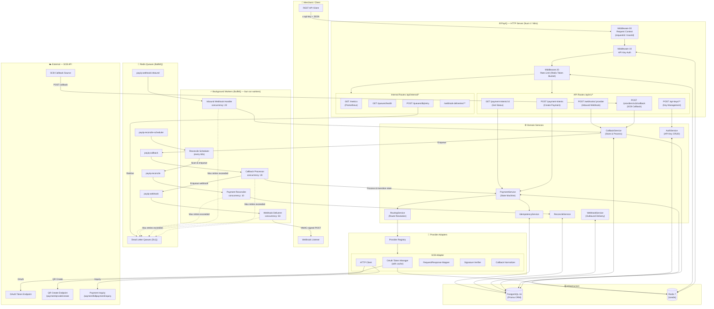
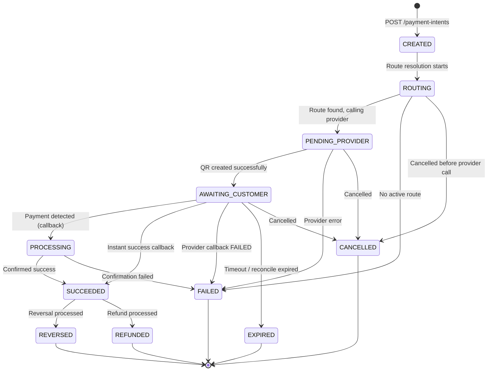
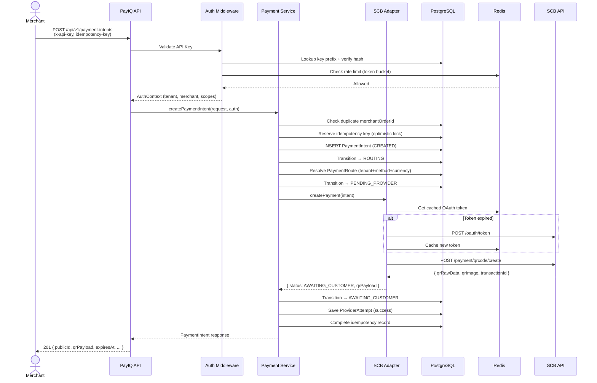
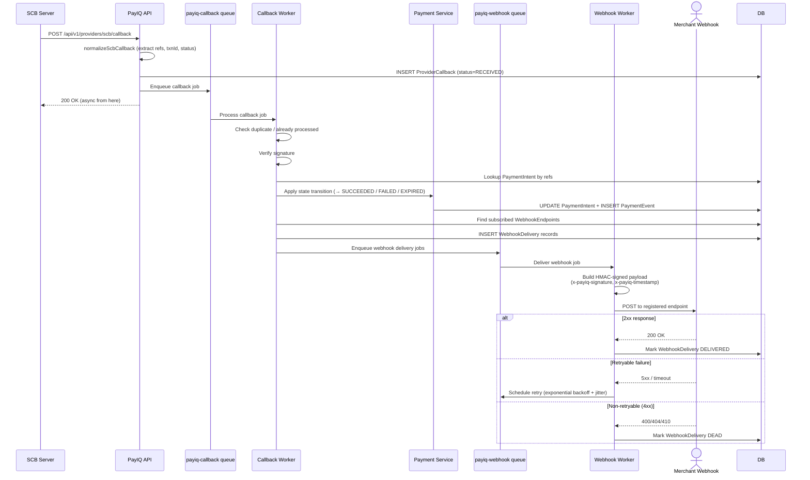
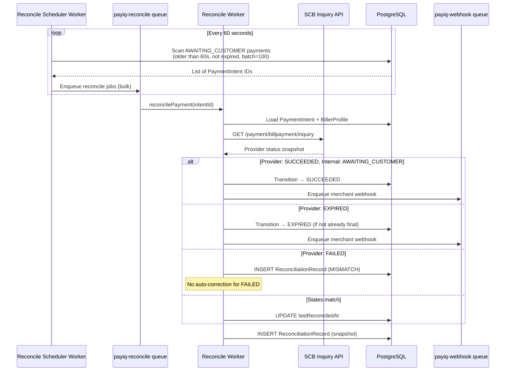
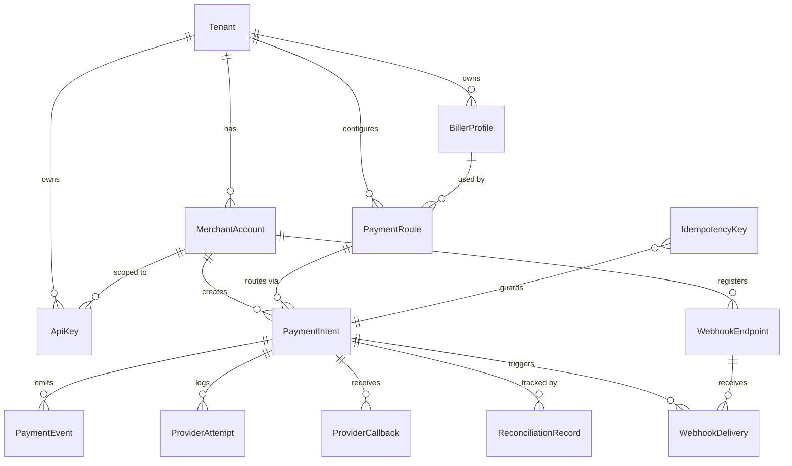

# PayIQ — Payment Gateway Middleware

**PayIQ** คือ Payment Gateway Middleware Platform สร้างบน Nuxt 4 (Nitro/H3) ทำหน้าที่เป็น **Abstraction Layer** ระหว่าง Merchant กับ Payment Provider (ปัจจุบันรองรับ SCB PromptPay QR) โดยจัดการครบวงจรตั้งแต่ สร้าง Payment Intent, รับ Callback จาก Provider, แจ้ง Webhook ไปยัง Merchant และ Reconcile สถานะอัตโนมัติ

---

## Logical Architecture Diagram



---

## Payment Intent State Machine



> ทุก state transition บันทึกใน **PaymentEvent** (immutable audit trail) และดำเนินการภายใน Postgres Transaction พร้อม Optimistic Lock

---

## Payment Creation Flow (Sequence)



---

## Callback & Webhook Delivery Flow (Sequence)



---

## Reconciliation Flow



---

## Database Schema Overview



---

## Overview การทำงาน

### สิ่งที่ PayIQ ทำ
PayIQ เป็น **middleware** ที่ซ่อนความซับซ้อนของ Payment Provider ไว้ภายใน Merchant เรียก API เดียว ได้รับ QR Code กลับมาพร้อมใช้งาน ส่วนทุกอย่างหลังจากนั้น (Callback, State, Webhook, Reconcile) ระบบจัดการเองทั้งหมด

### Components หลัก

| Component | หน้าที่ |
|---|---|
| **HTTP Server** (Nuxt 4 / Nitro) | รับ API requests จาก Merchant ผ่าน REST API |
| **Middleware Pipeline** | ตรวจสอบ Request Context → Auth → Rate Limit ตามลำดับ |
| **Domain Services** | Business logic ทั้งหมด แยกเป็น Services ตาม Domain |
| **Provider Adapters** | ห่อหุ้ม SCB API ไว้ใน interface กลาง (พร้อม Mock mode) |
| **BullMQ Workers** | ประมวลผล async jobs: Callback, Webhook, Reconcile |
| **PostgreSQL** | เก็บข้อมูลทั้งหมดผ่าน Prisma ORM (15 models) |
| **Redis** | Rate limit, Token bucket, OAuth token cache, Queue broker |

### Security ที่ใช้

- **API Key** format: `pk_test_<prefix>.<secret>` — prefix lookup + SHA-256 timing-safe compare
- **Rate Limiting** — Lua script atomic token bucket ต่อ API Key และ IP
- **Payment Spam Detection** — ตรวจ duplicate reference + amount velocity
- **Webhook Signature** — HMAC-SHA256 ทั้ง inbound (จาก SCB) และ outbound (ไป Merchant)
- **IP Allowlist** — กรอง IP สำหรับ inbound webhook endpoint

### Multi-tenant Design

- ทุก resource ผูก `tenantId` ชัดเจน
- `BillerProfile` เก็บ SCB credentials แยกต่อ Tenant (รองรับหลาย Tenant ใช้ SCB credential คนละชุด)
- `ApiKey` scope ได้ถึงระดับ `MerchantAccount`

---

## Quick Start

```bash
# 1. ตั้งค่า environment
cp .env.example .env

# 2. เปิด PostgreSQL + Redis
bun run db:up

# 3. ติดตั้ง dependencies
bun install

# 4. สร้าง Prisma client + migrate DB
bun run prisma:generate
bun run prisma:migrate

# 5. Seed ข้อมูลตั้งต้น
bun run seed

# 6. เปิด HTTP Server
bun run dev
```

เปิดอีก terminal สำหรับ Background Workers:

```bash
bun run workers
```

---

## API Reference

### สร้าง Payment Intent

```bash
curl -X POST http://localhost:3000/api/v1/payment-intents \
  -H "Content-Type: application/json" \
  -H "x-api-key: <your-api-key>" \
  -H "idempotency-key: demo-key-001" \
  -d '{
    "tenantCode": "demo",
    "merchantCode": "default",
    "merchantOrderId": "ORD-1001",
    "merchantReference": "INV-8899",
    "amount": "20.00",
    "currency": "THB",
    "paymentMethodType": "PROMPTPAY_QR",
    "customerName": "John Doe"
  }'
```

### ดู Payment Intent

```bash
curl http://localhost:3000/api/v1/payment-intents/<publicId> \
  -H "x-api-key: <your-api-key>"
```

### จำลอง SCB Callback (dev/test)

```bash
curl -X POST http://localhost:3000/api/v1/providers/scb/callback \
  -H "Content-Type: application/json" \
  -H "x-signature: dummy" \
  -d '{
    "partnerPaymentId": "<publicId>",
    "transactionId": "scb-demo-txn-001",
    "status": "SUCCESS"
  }'
```

---

## Environment Variables หลัก

| Variable | ความหมาย |
|---|---|
| `DATABASE_URL` | PostgreSQL connection string |
| `REDIS_URL` | Redis connection string |
| `APP_BASE_URL` | Public URL ของ server (ใช้สร้าง callback URL) |
| `SCB_API_KEY` | SCB application key |
| `SCB_API_SECRET` | SCB application secret |
| `SCB_BILLER_ID` | SCB biller ID |
| `SCB_ENV` | `sandbox` หรือ `production` |
| `PAYIQ_PROVIDER_MODE` | `mock` = ไม่เรียก SCB จริง (สำหรับ dev) |
| `WEBHOOK_SECRET` | HMAC secret สำหรับ verify inbound webhook |

---

## Stack

| Layer | Technology |
|---|---|
| Framework | Nuxt 4, Nitro, H3 |
| Runtime | Bun |
| Database | PostgreSQL 16 + Prisma ORM |
| Cache / Queue | Redis 7 + ioredis + BullMQ |
| Validation | Zod |
| Metrics | prom-client (Prometheus) |
| Dev Infra | Docker Compose |
| Testing | Bun test runner |
| Language | TypeScript (strict mode) |
